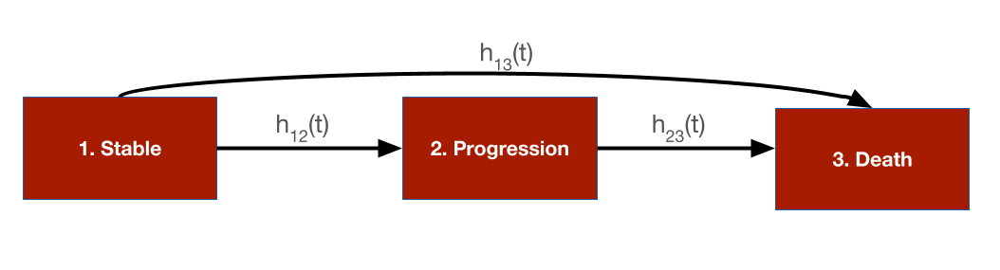

# Overview
In this tutorial we use a continuous time state transition model (CTSTM) and relax many of the assumptions made in cohort discrete time state transition models (DTSTMs). First, since the model is in continuous time we do not require model cycles. Second, we estimate the parameters of the health state transitions using a multi-state model so that the simulation model is completely integrated with an underlying statistical model. Third, we use individual patient simulation (IPS) to simulate a semi-Markov model, meaning that (unlike in a Markov model) transitions cannot depend on prior history. 

To illustrate, we simplify the sick-sicker model so that it only contains three health states and modify the states---*Stable*, *Progression*, and *Dead*---to mimic an oncology application where patients transition from stable disease to progression to death. There are three transitions: (1) *Stable* to *Progression*, (2) *Stable* to *Dead*, and (3) *Progression* to *Dead*.

```{r, out.width = "600px", echo = FALSE}

```

The following packages and settings will be used for the analysis. Note that while individual-level simulations can be computationally intensive, they run very quickly in `hesim` because they are implemented fully in `C++` under the hood. You can learn more by looking at the `hesim` [multi-state modeling](https://hesim-dev.github.io/hesim/articles/mstate.html) vignette. 

```{r, warning = FALSE, message = FALSE}
library("rcea")
library("hesim")
library("data.table")
library("ggplot2")
library("flexsurv")

set.seed(101) # Make random number generation reproducible
```

# Background
Multi-state models are generalizations of survival models to more than 2 states that estimate hazard functions for each possible transition. Flexible survival models can be used for each transition ensuring that the rates at which patients transition between states are consistent with the available data. 

Different assumptions can be made about the time scales used to determine the hazards. In a *clock forward* (i.e., *Markov*) model, transition hazards depends on time since entering the initial health state. Conversely, in a *clock reset* (i.e., *semi-Markov*) model, the hazards are a function of time since entering the current state (i.e., time resets to 0 each time a patient enters a new state). 

Importantly, state occupancy probabilities in clock-reset models can only be simulated in a general fashion using IPS (although tunnel states can be used in a cohort model to approximate a semi-Markov process). In an IPS multiple patients are simulated and the expected value of outcomes is computed by averaging across patients. It is important to simulate enough patients so that the expected values are stable and not subject to significant Monte Carlo error. 

We suggest the tutorial by [Putter et al.](https://onlinelibrary.wiley.com/doi/abs/10.1002/sim.2712) for additional details on multi-state modeling.

# Model setup
The transitions of a multi-state model in `hesim` must be characterized by a matrix where each element denotes a transition from a row to a column. If a transition is not possible it is marked with `NA`; otherwise, an integer denotes the transition number.  

```{r}
tmat <- rbind(
  c(NA, 1, 2),
  c(NA, NA, 3),
  c(NA, NA, NA)
)
colnames(tmat) <- rownames(tmat) <- c("Stable", "Progression", "Dead")
print(tmat)
```

As in the cohort model, we must specify the target population and treatment strategies of interest. Unlike the cohort model we simulate 1,000 patients which should be enough to produce reasonably stable results. We also explicitly define the health states, which we will use to model utility and costs. 

```{r}
n_patients <- 1000
patients <- data.table(
  patient_id = 1:n_patients,
  age = rnorm(n_patients, mean = 45, sd = 7),
  female = rbinom(n_patients, size = 1, prob = .51)
)

states <- data.table(
  state_id = c(1, 2),
  state_name = c("Stable", "Progression") # Non-death health states
)
n_states <- nrow(states)

strategies <- data.frame(
  strategy_id = 1:2,
  strategy_name = c("SOC", "New")
)
n_strategies <- nrow(strategies)

hesim_dat <- hesim_data(
  strategies = strategies,
  patients = patients,
  states = states
)
print(hesim_dat)
```

# Parameter estimation
In the cohort examples, we used parameter estimates derived from external sources. An alternative approach is to estimate the parameters directly with `R`. We will take that approach here for the multi-state model and estimate the transition specific hazards using `flexsurv`. Conversely, we will continue to use mean values for utility and costs.

## Multi-state model
Multi-state data consists of one row for each possible transition from a given health state where only one transition is observed and all others are censored. We created the function `sim_mstate_data()` which leverages `hesim` to simulate a hypothetical cohort of 2000 patients for a stable-progression-death model.

```{r}
data <- rcea::sim_mstate3_data(n = 2000)
data[patient_id %in% c(1, 2)]
```

Multi-state models can be fit by estimating a joint survival model with interaction terms for different transition (see the `hesim` [introductory vignette](https://hesim-dev.github.io/hesim/articles/intro.html) for more details) or by fitting separate survival models for each transition. We will take the latter approach and and fit 3 parametric Weibull models. (Note that in an applied example you should compare the performance of multiple distributions. Type `?params_surv` to view the survival distributions supported by `hesim`.) 

```{r}
n_trans <- max(tmat, na.rm = TRUE) # Number of transitions
wei_fits <- vector(length = n_trans, mode = "list")
for (i in 1:length(wei_fits)){
  wei_fits[[i]] <- flexsurvreg(
    Surv(time, status) ~ strategy_name + female,
    data = data,
    subset = (transition_id == i) ,
    dist = "weibull")
}
wei_fits <- flexsurvreg_list(wei_fits)
```

## Utility and costs
In the cohort model, we assigned utility and cost values to health states using `hesim::define_tparams()` within the `hesim::define_model()` framework. An alternative (and more direct) approach is to use a `hesim::stateval_tbl`. We will continue to assume that the utility associated with each state follows a beta distribution. 

```{r}
utility_tbl <- stateval_tbl(
  data.table(state_id = states$state_id,
             mean = c(H = .8, S = .6),
             se = c(0.02, .05)
            ),
  dist = "beta",
  hesim_data = hesim_dat)
print(utility_tbl)
```

Similarly, we continue to assume that medical costs vary by health state and follow a gamma distribution.

```{r}
medcost_tbl <- stateval_tbl(
  data.table(state_id = states$state_id,
             mean = c(H = 2000, S = 9500),
             se = c(H = 2000, S = 9500)
             ),
  dist = "gamma",
  hesim_data = hesim_dat)
print(medcost_tbl)
```

Treatment costs remain fixed as in the cohort model, but we now allow costs to vary over time in the progression state. Specifically, we assume that costs for the new treatment are \$12,000 for the first 3 months and then \$10,000 thereafter. This approximate a common scenario in oncology where the new treatment is given in combination with chemotherapy but the chemotherapy is only given for a fixed number of cycles. This would not be possible in a cohort model without creating a tunnel state approximating the 3 months of chemotherapy in the progression state.  


```{r}
n_times <- 2
drugcost_tbl <- stateval_tbl(
  data.table(
    strategy_id = rep(strategies$strategy_id, each = n_states * n_times),
    state_id = rep(rep(states$state_id, each = n_strategies), n_times),
    time_start = rep(c(0, 3/12), n_states * n_strategies),
    est = c(rep(2000, 4), # Costs are always the same with SOC
            12000, 12000, 12000, 10000 # Costs with new drop after 3 months in progression state
          )  
    ),
  dist = "fixed",
  hesim_data = hesim_dat)
print(drugcost_tbl)
```

# Simulation
## Constructing the economic model
Economic models in `hesim` can be constructed in one of two ways: first, by defining the model using `hesim::define_model()`, and secondly, with explicit statistical models. We used the first approach for the cohort model but will use the latter here. 

500 iterations are used for the probabilistic sensitivity analysis. (In an applied application you should check the sensitivity of the results to this number and may want to increase it.) 

```{r}
n_samples <- 500
```

### Disease model
Health state transition models in `hesim` are a function of input data (i.e., covariates) and a fitted multi-state model (or a parameter object such as `hesim::params_surv()`). Since we fit separate models for each transition, the input data consists of one observation for each treatment strategy and patient combination (joint models consist of one observation for each treatment strategy, patient, and transition combination). The data can be created easily by using the `hesim::expand()` function to expand the `hesim_data` object created above.

```{r}
transmod_data <- expand(hesim_dat,
                        by = c("strategies", "patients"))
head(transmod_data)
```

In addition to the input data and model, we must also specify the viable transitions, the clock ("reset" or "forward"), and the starting age of each simulated patient (so that we can control the maximum age they can live to and ensure that they do not live to unrealistically high ages).

```{r}
transmod <- create_IndivCtstmTrans(wei_fits, transmod_data,
                                   trans_mat = tmat, n = n_samples,
                                   clock = "reset",
                                   start_age = patients$age)
```

### Utility and cost models
Since the utility and cost models are based on predicted means (see `hesim::tparams_mean()`), they do not include covariates and therefore do not require input data. The cost and utility models can therefore be constructed directly from the utility and cost tables.

```{r}
# Utility
utilitymod <- create_StateVals(utility_tbl, n = n_samples)

# Costs
drugcostmod <- create_StateVals(drugcost_tbl, n = n_samples)
medcostmod <- create_StateVals(medcost_tbl, n = n_samples)
costmods <- list(Drug = drugcostmod,
                 Medical = medcostmod)
```

### Combining the disease progression, cost, and utility models
In the cohort model we initialized the economic model from a `model_def` object (the output of `define_model()`) and the separate the transition, utility, and cost models were constructed under the hood. We do that directly here.

```{r}
econmod <- IndivCtstm$new(trans_model = transmod,
                          utility_model = utilitymod,
                          cost_models = costmods)
```

## Simulating outcomes

### Disease progression
Disease progression is simulated using the `$sim_disease()` method, which simulates unique trajectories through the multi-state model for each patient, treatment strategy, and PSA sample. Patients transition `from` an old health state that was entered at time `time_start` `to` a new health state at time `time_stop`. 

```{r}
econmod$sim_disease(max_age = 100)
head(econmod$disprog_)
```

The IPS can be summarized by computing state occupancy probabilities at different time points. We do that using `$sim_stateprobs()`. 

```{r}
econmod$sim_stateprobs(t = seq(0, 30 , 1/12))
```

```{r, echo = FALSE, fig.width = 7, fig.height = 4}
# Short function add create state name variable to data.table
add_state_name <- function(x){
  x[, state_name := factor(state_id,
                           levels = 1:nrow(tmat),
                           labels = colnames(tmat))]
}

# Short function to create state probability "dataset" for plotting
summarize_stprobs <- function(stateprobs){
  x <- stateprobs[, .(prob_mean = mean(prob)),
                  by = c("strategy_id", "state_id", "t")]
  add_state_name(x)
}

# Plot of state probabilities
stprobs <- summarize_stprobs(econmod$stateprobs_)
ggplot(stprobs, 
       aes(x = t, y = prob_mean, 
          col = factor(strategy_id, labels = c("SOC", "New")))) +
  geom_line() + facet_wrap(~state_name) +
  xlab("Years") + ylab("Probability in health state") +
  scale_color_discrete(name = "Strategy") +
  theme(legend.position = "bottom") +
  theme_bw()
```

### QALYs and costs
Like the cohort model, we can compute quality-adjusted life-years (QALYs) after simulating disease progression using the `$sim_qalys()` method. Let's compute QALYs for different discount rates, which might be useful for summarizing the impact of the new treatment on QALYs. 

```{r}
econmod$sim_qalys(dr = c(0,.03))
head(econmod$qalys_)
```

Costs for each category are simulated in a similar fashion.
```{r}
econmod$sim_costs(dr = 0.03)
head(econmod$costs_)
```

# Cost-effectiveness analysis
As in the cohort model, cost-effectiveness analyses can be performed seamlessly from the simulation output.

```{r}
ce_sim <- econmod$summarize()
icea_pw_out <- icea_pw(ce_sim, comparator = 1, 
                       dr_qalys = .03, dr_costs = .03,
                       k = seq(0, 25000, 500))
icer_tbl(icea_pw_out, colnames = strategies$strategy_name)
```

```{r, echo = FALSE}
saveRDS(ce_sim, "ce_sim.rds")
```