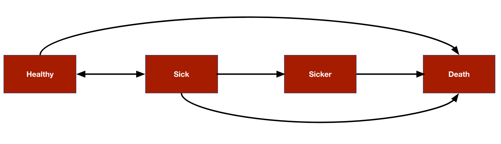

# Overview
The most commonly used model for cost-effectiveness analysis (CEA) is the cohort discrete time state transition model (cDTSTM), commonly referred to as a Markov cohort model. In this tutorial we demonstrate implementation with `R` of the simplest of cDSTMs, a time-homogeneous model with transition probabilities that are constant over time. The entire analysis can be run using [Base R](https://stat.ethz.ch/R-manual/R-devel/library/base/html/00Index.html) (i.e., without installing any packages). However, we will use the following packages to create a nice looking cost-effectiveness table. 

```{r}
library("knitr")
library("kableExtra")
library("magrittr")
library("tibble")
```

As an example, we will consider the 4-state sick-sicker model that has been described in more detail by [Alarid-Escudero et al](https://arxiv.org/abs/2001.07824). The model will be used to compare two treatment strategies, a "New" treatment and the existing "standard of care (SOC)". The model consists 4 health states. Ordered from worst to best to worst, they are: Healthy (*H*), Sick (*S1*), Sicker (*S2*), and Death (*D*). Possible transitions from each state are displayed in the figure below.

```{r, out.width = "700px", echo = FALSE}

```

# Theory

## Transition probabilities
Transition probabilities are the building blocks of Markov cohort models and used to simulate the probability that a cohort of patients is in each health state at each model cycle. To set notation, let $p_t$ be the transition probability matrix governing transitions from one time period (i.e., model cycle) to the next. $x_t$ is the state occupancy vector at time $t$. In this example, $p_t$ is a $4 \times 4$ matrix and $x_t$ is a $1 \times 4$ vector containing the proportion of patients in each of the 4 health states. 

At time $0$, the state vector is $x_0 = (1, 0, 0, 0)$ since all patients are healthy. The state vector at time $t+1$ for each of $T$ model cycles can be computed using matrix multiplication,

$$
x_{t+1}= x_t p_t, \quad t = 0,\ldots,T
$$
The matrix containing state vectors across all model cycles is often referred to as the "Markov trace" in health economics. Note that since we are considering a time-homogeneous model in this example, we can remove the subscript from the transition matrix and set $p_t = p$.

## Costs and outcome
To perform a CEA, Markov models estimate expected (i.e., average) costs and outcomes for the cohort of interest. In our examples, quality-adjusted life-years (QALYs) will be used as the outcome. 

Costs and QALYs are computed by assigning values to the health states (i.e., "state values") and weighting the time spent in each state by these state values. For example, if utility in each of the four health states is given by the $4 \times 1$ vector $u = (1, 0.75, 0.5, 0)^T$ and say, $x_1 = (.8, .1, 0.08, 0.02)$, then the weighted average utility would be given by $x_{1}u = 0.915$. More generally, we can define a state vector at time $t$ as $z_t$ so that the expected value at time $t$ is given by

$$
EV_t = x_{t}z_{t}
$$

Future cost and outcomes are discounted using a discount rate. In discrete time, the "discount weight" at time $t$ is given by $1/(1 + r)^t$ where $r$ is the discount rate; in continuous time, it is given by $e^{-rt}$. We will use discrete time here, meaning that the present value of expected values are given by,

$$
PV_t = \frac{EV_t}{(1+r)^t}
$$
The simplest way to aggregate discounted costs across model cycles is with the net present value,

$$
NPV = \sum_{t} PV_t
$$

It is important to note that in mathematical terms this a discrete approximation to a continuous integral, also known as a Riemann sum. That is, we only know that an expected value lies within a time interval (e.g., in model cycle 1, between year 0 and 1; in model cycle 2, between year 1 and 2; and so on). If we assume that events occur at the start of model cycles (i.e., a left Riemann sum), then expected values will be underestimated; conversely, if we assume that they occur at the end of model cycles (i.e., a right Riemann sum), then they will be overestimated. Another option is to use average of values at the left and right endpoints (i.e., the trapezoid rule). We will assume events occur at the start of model cycles.

# Model parameters
## Transition probabilities
### Standard of care
The annual transition probabilities for SOC among our cohort of interest, say 25-year old patients, are defined as follows.

```{r}
p_hd <- 0.002 # constant probability of dying when Healthy (all-cause mortality)
p_hs1 <- 0.15 # probability of becoming Sick when Healthy
p_s1h <- 0.5 # probability of becoming Healthy when Sick
p_s1s2 <- 0.105 # probability of becoming Sicker when Sick
p_s1d <- .006 # constant probability of dying when Sick
p_s2d <- .02 # constant probability of dying when Sicker
```

These can be used to derive the probabilities of remaining in the same state during a model cycle.

```{r, message = FALSE}
p_hh <- 1  - p_hs1 - p_hd
p_s1s1 <- 1 - p_s1h - p_s1s2 
p_s2s2 <- 1 - p_s2d
```

Using these probabilities, the transition probability matrix can then be defined.

```{r}
p_soc <- matrix(
  c(p_hh,  p_hs1,  0,      p_hd,
    p_s1h, p_s1s1, p_s1s2, p_s1d,
    0,     0,      p_s2s2, p_s2d,
    0,     0,      0,      1),
  byrow = TRUE,
  nrow = 4, ncol = 4
)
state_names <- c("H", "S1", "S2", "D")
colnames(p_soc) <- rownames(p_soc) <- state_names
print(p_soc)
```

### New treatment
In evidence synthesis and cost-effectiveness modeling, treatment effects are typically estimated in relative terms; i.e., the effect of an intervention is assessed relative to a reference treatment. In this case, the SOC is the reference treatment and the effectiveness of the new treatment is assessed relative to the SOC. For simplicity, we will assume that treatment effects are defined in terms of the relative risk, which is assumed to reduce the probability of all transitions to a more severe health state by an equal amount. Note that this is somewhat unrealistic since relative risks are a function of baseline risk and would be unlikely to be equal for each transition. A more appropriate model would define treatment effects in terms of a measure that is invariant to baseline risk such as an odds ratio (which might still vary for each transition). 

The relative risk can then be used to create the transition matrix for the new treatment. We will use assume the relative risk is $0.8$. 

```{r, message = FALSE}
apply_rr <- function(p, rr = .8){
  p["H", "S1"] <- p["H", "S1"] * rr
  p["H", "S2"] <- p["H", "S2"] * rr
  p["H", "D"] <- p["H", "S2"] * rr
  p["H", "H"] <- 1 - sum(p["H", -1])
  
  p["S1", "S2"] <- p["S1", "S2"] * rr
  p["S1", "D"] <- p["S1", "D"] * rr
  p["S1", "S1"] <- 1 - sum(p["S1", -2])
  
  p["S2", "D"] <- p["S2", "D"] * rr
  p["S2", "S2"] <- 1 - sum(p["S2", -3])
  
  return(p)
}

p_new <- apply_rr(p_soc, rr = .8)
```

## Utility and costs
Utility and (annualized) costs are defined below. We consider two types of costs: medical and treatment. Both utility and costs are 0 in the death state. Treatment costs are assumed equal in each health state. 

```{r, message = FALSE}
utility <- c(1, .075, 0.5, 0)
costs_medical <- c(2000, 4000, 15000, 0)
costs_treat_soc <- c(rep(2000, 3), 0)
costs_treat_new <- c(rep(12000, 3), 0)
```

# Simulation
## Health state probabilities
To simulate health state probabilities, we must specify a state vector at time 0. Each patient will start in the Healthy state. 

```{r, message = FALSE}
x_init <- c(1, 0, 0, 0)
```

The state vector during cycle $1$ for SOC is computed using simple matrix multiplication.

```{r, message = FALSE}
x_init %*% p_soc  
```

We can also easily compute the state vector at cycle 2 for SOC.
```{r, message = FALSE}
x_init %*% 
  p_soc %*% 
  p_soc 
```

A for loop can be used to compute the state vector at each model cycle. Let's create a function to do this. The model will be simulated until a maximum age of 110; that is, for 85 years for a cohort of 25-year olds.

```{r}
sim_markov_trace <- function(x0, p, n_cycles = 85){
  x <- matrix(NA, ncol = length(x0), nrow = n_cycles) # Initialize Markov trace
  x <- rbind(x0, x) # Markov trace at cycle 0 is initial state vector
  colnames(x) <- colnames(p) # Columns are the health states
  rownames(x) <- 0:n_cycles # Rows are the model cycles
  for (t in 1:n_cycles){ # Simulating state vectors at each cycle with for loop
    x[t + 1, ] <- x[t, ] %*% p
  }
  return(x)
}
```


We perform the computation for both the SOC and new treatment. As expected, patients remain in less severe health states longer when using the new treatment.

```{r, message = FALSE}
x_soc <- sim_markov_trace(x_init, p_soc)
x_new <- sim_markov_trace(x_init, p_new)

head(x_soc)
head(x_new)
```

## Expected costs and quality-adjusted life-years 
To compute discounted costs and QALYS, it is helpful to write a general function for computing a present value.

```{r}
pv <- function(z, dr, t) {
  z/(1 + dr)^t
}
```

### QALYs
To illustrate a computation, lets start with discounted expected QALYs after the first model cycle. 

```{r}
x_soc[2, ] # State occupancy probabilities after 1st cycle
invisible(sum(x_soc[2, 1:3])) # Expected life-years after 1st cycle
invisible(sum(x_soc[2, ] * utility)) # Expected utility after 1st cycle
sum(pv(x_soc[2, ] * utility, .03, 1)) # Expected discounted utility after 1st cycle
```

Now let's compute expected (discounted) QALYs for each cycle.

```{r}
compute_qalys <- function(x, utility, dr = .03){
  n_cycles <- nrow(x) - 1
  pv(x %*% utility, dr, 0:n_cycles)
}

qalys_soc <- x_soc %*% utility 
dqalys_soc <- compute_qalys(x_soc, utility = utility)
dqalys_new <- compute_qalys(x_new, utility = utility)

head(qalys_soc)
head(dqalys_soc)
head(dqalys_new)
```

### Costs
We can do the same for costs. The first column is medical costs and the second column is treatment costs.

```{r}
compute_costs <- function(x, costs_medical, costs_treat, dr = .03){
  n_cycles <- nrow(x) - 1
  costs <- cbind(
    pv(x %*% costs_medical, dr, 0:n_cycles),
    pv(x %*% costs_treat, dr, 0:n_cycles)
  )
  colnames(costs) <- c("medical", "treatment")
  return(costs)
}

dcosts_soc <- compute_costs(x_soc, costs_medical, costs_treat_soc)
dcosts_new <- compute_costs(x_new, costs_medical, costs_treat_new)

head(dcosts_soc)
head(dcosts_new)
```

# Cost-effectiveness analysis
We conclude by computing the incremental cost-effectiveness ratio (ICER) with the new treatment relative to SOC. It can be computed by summing the costs and QALYs we simulated in the previous section across all model cycles.

```{r, message=FALSE}
(sum(dcosts_new) - sum(dcosts_soc))/(sum(dqalys_new) - sum(dqalys_soc))
```

For the sake of presentation, we might want to do a some extra work and create a nice looking table.

```{r}
format_costs <- function(x) formatC(x, format = "d", big.mark = ",")
format_qalys <- function(x) formatC(x, format = "f", digits = 2)
make_icer_tbl <- function(costs0, costs1, qalys0, qalys1){
  # Computations
  total_costs0 <- sum(costs0)
  total_costs1 <- sum(costs1)
  total_qalys0 <- sum(qalys0)
  total_qalys1 <- sum(qalys1)
  incr_total_costs <- total_costs1 - total_costs0
  inc_total_qalys <- total_qalys1 - total_qalys0
  icer <- incr_total_costs/inc_total_qalys
  
  # Make table
  tibble(
    `Costs` = c(total_costs0, total_costs1) %>%
      format_costs(), 
    `QALYs` = c(total_qalys0, total_qalys1) %>%
      format_qalys(),
    `Inremental costs` = c("--", incr_total_costs %>% 
                             format_costs()),
    `Inremental QALYs` = c("--", inc_total_qalys %>% 
                             format_qalys()),
    `ICER` = c("--", icer %>% format_costs())
) %>%
  kable() %>%
  kable_styling() %>%
  footnote(general = "Costs and QALYs are discounted at 3% per annum.",
           footnote_as_chunk = TRUE)
}
make_icer_tbl(costs0 = dcosts_soc, costs1 = dcosts_new,
              qalys0 = dqalys_soc, qalys1 = dqalys_new)

```
